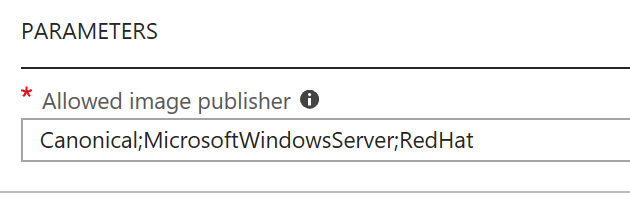
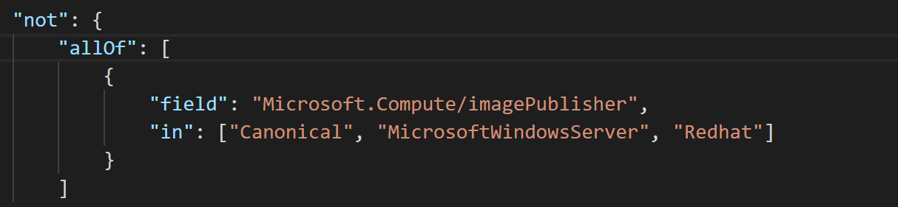

# Tips and Tricks

Below are some tips and tricks that I picked up while working with Azure Policy - enjoy!

# Table of contents

- [Assigning policies with PowerShell or CLI](#assigning-policies-with-powershell-or-cli)
    + [PowerShell Example](#powershell-example)
    + [CLI Example](#cli-example)
- [Syntax for Parameters](#syntax-for-parameters)
    + [GUI Syntax](#gui-syntax)
    + [Code Syntax](#code-syntax)
- [Using Parameters](#using-parameters)
    + [Powershell Parameters](#powershell-parameters)
    + [CLI Parameters](#cli-parameters)

## Assigning policies with PowerShell or CLI

When you create policy assignments with PowerShell or CLI remember to assign a pricing tier/SKU within your command.  If you don't specify a pricing tier/SKU it will automatically default to the Free tier.  With the Free tier you can only enforce policies on future resources, with Standard, you can also enforce them on existing resources.

Within PowerShell use the following addition to your New-AzureRMPolicyAssignment command:

**-sku @{"Name" = "A1"; "Tier" = "Standard"}**

Wthin CLI use the following addition to your az policy assignment create command:

**--sku 'standard'**

### PowerShell Example

Below is an example of the code you would use to create a policy definition with PowerShell and then create the policy assignment including the Standard SKU.

````powershell
#Define allowed publishers
$allowedpublishers = "Canonical", "MicrosoftWindowsServer", "RedHat"

#Define ResourceGroup Policy will be applied to
$ResourceGroup = Get-AzureRMResourceGroup -Name "ResourceGroup1"

#Setup Policy Defintion
$definition = New-AzureRmPolicyDefinition -Name "allowed-image-publishers-policy" -DisplayName "Only allow a certain image publishers offerings to be deployed" -description "This policy ensures that only allowed image publisher offerings are selected from the image repository" -Policy 'https://raw.githubusercontent.com/weeyin83/azurepolicyexamples/master/Compute/allowed-image-publishers/azurepolicy.rules.json' -Parameter 'https://raw.githubusercontent.com/weeyin83/azurepolicyexamples/master/Compute/allowed-image-publishers/azurepolicy.parameters.json' -Mode All
$definition

#Create Policy assignment using the new definition
$assignment = New-AzureRMPolicyAssignment -Name "Canonical-RedHat-WindowsServer-only-policy" -Scope $ResourceGroup.ResourceId -sku @{"Name" = "A1"; "Tier" = "Standard"} -listOfAllowedimagePublisher $allowedpublishers -PolicyDefinition $definition
$assignment
````

### CLI Example

Below is an example of the code you would use to create a policy definition with CLI and then create the policy assignment including the Standard SKU.

````cli

az policy definition create --name 'enforce-storage-skus' --display-name 'Ensure deployment of allowed Storage SKUs only' --description 'Ensure only approved Storage SKUs can be deployed' --rules 'https://raw.githubusercontent.com/weeyin83/azurepolicyexamples/master/Storage/enforce-storage-skus/azurepolicy.rules.json' --params 'https://raw.githubusercontent.com/weeyin83/azurepolicyexamples/master/Storage/enforce-storage-skus/azurepolicy.parameters.json' --mode All

az policy assignment create --name 'enforce storage' --scope '/subscriptions/00000000-0000-0000-000000000000' --policy "enforce-storage-skus" --params '{"listOfAllowedSKUs":{"value": [ "Standard_GRS"]}}' --sku 'standard'
````

## Syntax for Parameters

When you create a policy definition you can choose to have a field that uses dynamic entries.

### GUI Syntax

When you use try to create an assignment of one of the policies you will be asked for the values, within the GUI the synatx for adding multiple values use a **;** between values with no spaces.  Below is a screenshot demonstrating this syntax:



### Code Syntax

When you are using static parameter entries within your policy definitions the correct syntax for adding mutliple values is to using quotation marks around each entry, followed by a comma and then a space before the next value.  Below is a screenshot demonstrating this:



## Using Parameters

When you assign policies using PowerShell or CLI you may have to define parameters within your code lines. The best way I have I have found to do this within both lanaguages is as follows:

### PowerShell Parameters

Within PowerShell you can use variables to set the parameters that your policy needs.  We should first define the policy that we want to use.  In this example I am going to use a policy that only allows certain Storage SKUs to deployed. So to define the policy I will run this code: 

````Powershell
$definition = New-AzureRmPolicyDefinition -Name "enforce-storage-skus" -DisplayName "Ensure deployment of allowed Storage SKUs only" -description "Ensure only approved Storage SKUs can be deployed" -Policy 'https://raw.githubusercontent.com/weeyin83/azurepolicyexamples/master/Storage/enforce-storage-skus/azurepolicy.rules.json' -Parameter 'https://raw.githubusercontent.com/weeyin83/azurepolicyexamples/master/Storage/enforce-storage-skus/azurepolicy.parameters.json' -Mode All
````

Now with the policy defined I can start to define how the policy will be used within my environment.  The policy I have used has the parameter **listOfAllowedSKUs** that needs to be defined. I am only going to allow Standard SKUs to be used so I will define this by using a variable:

````PowerShell
$allowedskus = "Standard_LRS", "Standard_GRS", "Standard_RAGRS"
````

Note I surround each SKU with **quotations** and then seperate the multiple values with a **comma**

Now that the parameter has been defined I can look to create the assignment:

````PowerShell
$assignment = New-AzureRMPolicyAssignment -Name "Only allow deployment of Standard SKUs" -Scope /subscriptions/00000000-0000-0000-0000-000000000000 -sku @{"Name" = "A1"; "Tier" = "Standard"} -listOfAllowedSKUs $allowedskus -PolicyDefinition $definition
$assignment
`````

### CLI Parameters

The first thing you need to do is define your policy, in this example I am going to be using a policy that enforces which datacentre locations I am allowed to deploy resources into.  Within the policy that I am using there is a parameter called "listOfAllowedLocations" that will need to be defined.  I will use the following CLI code to define the policy:

````cli
az policy definition create --name 'enforce-location-deployments' --display-name 'Enforce Datacentre Locations' --description 'This policy enables you to control the locations where your resources are allowed to be deployed. Use this to enforce company guidelines.
' --rules 'https://raw.githubusercontent.com/weeyin83/azurepolicyexamples/master/Location/enforce-allowed-azurelocations/azurepolicy.rules.json' --params 'https://raw.githubusercontent.com/weeyin83/azurepolicyexamples/master/Location/enforce-allowed-azurelocations/azurepolicy.parameters.json' --mode All
````

Now that the policy definition is in place I can create an assignment. I need to remember to define the "listOfAllowedLocations" parameter within my code.  In this scenario I am going to set it so that only resources can be deployed to the UK West and UK South datacentres for my subscription:

````cli
az policy assignment create --name 'Enforce deployment to UK datacentres only' --scope '/subscriptions/00000000-0000-0000-000000000000' --policy "enforce-location-deployments" --params '{"listOfAllowedLocations":{"value": [ "ukwest", "uksouth"]}}' --sku 'standard'
````

As you can see above I used the command **--params** and then listed the name of the parameter just as it was listed in the policy definition then defined my values.  It's worth noting that while defining the values I had to use **quotation marks** around each value and seperated multiple values with a **comma**.  Also the datacentre location values are case sensitive and have to be inputted as expected.  So for example you can't use *UKWest*, it must be *ukwest*.  If you are unsure of how to define a datacentre location run the following command and it will show you the correct syntax:

````cli
az account list-locations
````